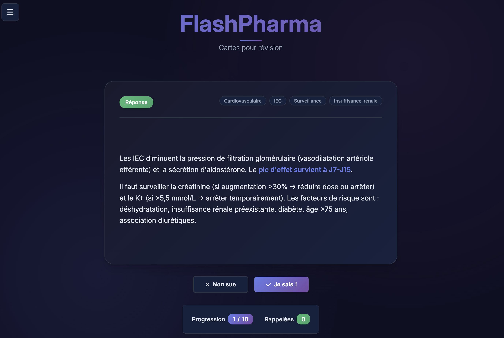

# FlashPharma: Pharmacist Flashcard Application

## 1. Overview

FlashPharma is a full-stack web application designed to help pharmacy students and professionals study and review their knowledge using interactive flashcards. The application features a clean, user-facing study interface and a powerful backend admin panel for comprehensive content management.



## 2. Architecture

The project is a monorepo containing three main components:

*   **Frontend Application (`/src`):** The main study interface for users. It's a single-page application (SPA) built with vanilla JavaScript that fetches published flashcards from the API. It handles study session setup, progress tracking, and user statistics.

*   **Admin Panel (`/admin`):** A separate SPA dedicated to content management. It allows administrators to create, edit, review, and publish flashcard content. It includes a Markdown editor with live preview, tag management, and a review workflow.

*   **Backend API (`/api`):** A Node.js and Express.js RESTful API that serves as the application's backbone. It connects to a PostgreSQL database, manages all data persistence, handles content rendering (Markdown to HTML), and enforces a content validation workflow.

The application runs on two servers:
1.  A root server (`server.js`) that serves the static files for the frontend and admin panel, and acts as a proxy for API requests.
2.  An API server (`api/server.js`) that handles all business logic and database interactions.

## 3. Features

### User Application
- **Interactive Flashcards:** Clean, intuitive interface with card-flipping animations.
- **Custom Study Sessions:** Configure sessions by number of questions, study mode (quick, focused, review), and difficulty.
- **Tag-Based Filtering:** Filter questions by specific tags and categories to focus on certain topics.
- **Progress Tracking:** In-depth statistics modal showing overall progress, recent session history, and identifying "weak" cards.
- **Revision Mode:** A dedicated mode to review cards the user has struggled with.
- **Dark/Light Mode:** Theme toggle for user preference.

### Admin Panel
- **Full CRUD for Questions & Tags:** Create, Read, Update, and Delete flashcards and their associated tags.
- **Markdown Editor:** A rich text editor for questions and answers with a live HTML preview.
- **Content Workflow:** A robust review and validation system (Draft -> Pending Review -> Validated -> Published).
- **Source Management:** Attach and manage multiple sources and citations for each flashcard.
- **Powerful Filtering and Sorting:** Easily find and manage questions with various filters (status, search term) and sorting options.

## 4. Tech Stack

| Component | Technology |
| :--- | :--- |
| **Frontend** | Vanilla JavaScript (ES6+), HTML5, CSS3 |
| **Backend** | Node.js, Express.js |
| **Database** | PostgreSQL |
| **API** | RESTful |
| **Styling** | Plain CSS with Font Awesome icons |
| **Markdown** | `marked` for server-side rendering |

## 5. Getting Started

### Prerequisites
- Node.js (v18 or later)
- npm
- PostgreSQL

### Installation & Setup

1.  **Clone the repository:**
    ```bash
    git clone https://github.com/laurentstaub/kevin_cards.git
    cd kevin_cards
    ```

2.  **Install dependencies:**
    ```bash
    npm install
    ```

3.  **Set up the database:**
    - Make sure your PostgreSQL server is running.
    - Create a new database named `flashpharma`.
    - Run the setup script to create the schema and initial data.
    ```bash
    npm run db:setup
    ```
    *Note: If you need to reset the database, you can run `npm run db:reset`.*

4.  **Environment Variables:**
    The API server uses a `.env` file for configuration. While one is not provided, you can create a file named `.env` in the `/api` directory for custom settings (e.g., `PORT`, database connection details if they differ from the defaults in `api/config/database.js`).

### Running the Application

The application requires two separate terminal sessions to run both the frontend/proxy server and the backend API server.

1.  **Start the Backend API Server:**
    In your first terminal, run:
    ```bash
    npm run api
    ```
    This will start the Node.js API server on `http://localhost:8084` (by default) using `nodemon`, which will automatically restart on file changes.

2.  **Start the Frontend Server:**
    In your second terminal, run:
    ```bash
    npm start
    ```
    This will start the main server on `http://localhost:8080` (by default).

3.  **Access the applications:**
    - **Study App:** Open your browser and navigate to `http://localhost:8080`
    - **Admin Panel:** Open your browser and navigate to `http://localhost:8080/admin`

## 6. Available Scripts

- `npm start`: Starts the main frontend server.
- `npm run dev`: An alias for `npm start`.
- `npm run api`: Starts the backend API server with `nodemon` for development.
- `npm run db:setup`: Sets up the database schema.
- `npm run db:reset`: Drops the existing database, creates a new one, and runs the setup script.
- `npm run load:db`: Runs a script to load questions into the database (see `load_questions_to_db.js`).

# Documentation de l'API Questions

## Points de terminaison (Endpoints)

### `POST /api/questions/regenerate-html`

Régénère le contenu HTML de toutes les questions existantes ou d'une sélection de questions à partir de leur source Markdown.

**Objectif :** Cette route est principalement un outil de migration et de maintenance. Elle est conçue pour être utilisée après un changement dans le système de rendu Markdown ou pour remplir les champs HTML pour des données anciennement stockées sans ces champs.

**Description :**
Ce point de terminaison parcourt les questions dans la base de données et exécute la fonction `regenerateHtml` pour chacune d'elles. Cette fonction prend `questionText` et `answerText` (qui sont au format Markdown) et génère leur équivalent HTML, puis met à jour l'enregistrement de la question dans la base de données avec ce nouveau contenu.

**Corps de la requête (Optionnel) :**

Vous pouvez envoyer un corps JSON pour spécifier quelles questions régénérer.

*   `questionIds` (Array[Number], optionnel) : Une liste d'IDs de questions spécifiques à régénérer. Si ce champ est omis ou est un tableau vide, **toutes les questions** de la base de données seront régénérées.

**Exemple de corps de requête (pour des questions spécifiques) :**

