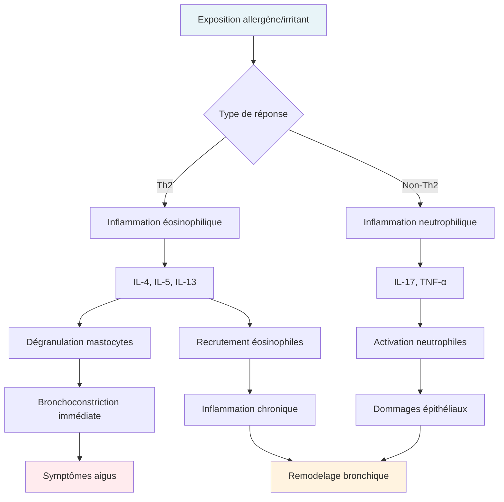
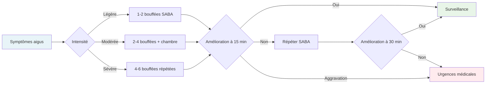
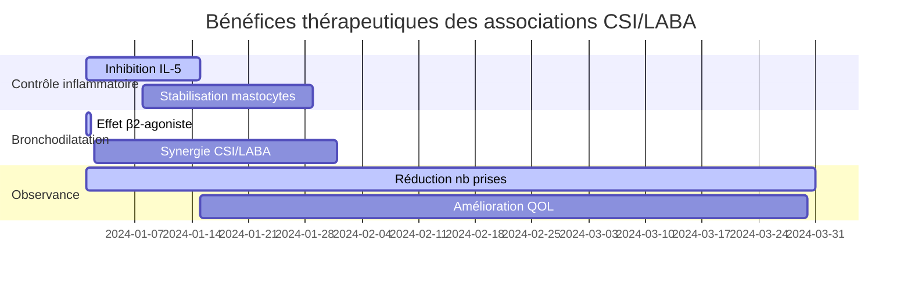
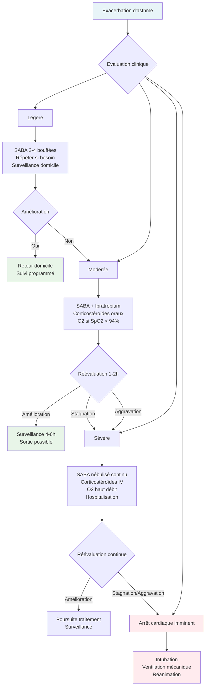

# Guide de l'asthme

## Acronymes et abréviations

**AINS** : Anti-inflammatoires non stéroïdiens
 **ANSM** : Agence nationale de sécurité du médicament et des produits de santé
 **BPCO** : Bronchopneumopathie chronique obstructive
 **CSI** : Corticostéroïdes inhalés
 **DFG** : Débit de filtration glomérulaire
 **EFR** : Épreuves fonctionnelles respiratoires
 **GINA** : Global Initiative for Asthma
 **HAS** : Haute Autorité de Santé
 **ICS** : Inhaled Corticosteroids
 **IgE** : Immunoglobulines E
 **IL** : Interleukine
 **LABA** : Long-Acting Beta2-Agonist (bêta-2 agonistes de longue durée d'action)
 **LAMA** : Long-Acting Muscarinic Antagonist (anticholinergiques de longue durée d'action)
 **LTRA** : Leucotriene Receptor Antagonist (antagonistes des récepteurs aux leucotriènes)
 **MDI** : Metered-Dose Inhaler (aérosol-doseur pressurisé)
 **NO** : Monoxyde d'azote
 **OMalizumab** : Anticorps monoclonal anti-IgE
 **SABA** : Short-Acting Beta2-Agonist (bêta-2 agonistes de courte durée d'action)
 **SAMA** : Short-Acting Muscarinic Antagonist (anticholinergiques de courte durée d'action)
 **VEMS** : Volume expiratoire maximal par seconde

## Introduction

### Prévalence et enjeux épidémiologiques

L'asthme constitue un enjeu majeur de santé publique touchant **339 millions de personnes dans le monde** selon l'Organisation mondiale de la santé. [En France, la prévalence de l'asthme atteint 6,7% de la population adulte, soit environ 4,15 millions de personnes](https://www.santepubliquefrance.fr/maladies-et-traumatismes/maladies-et-infections-respiratoires/asthme), avec une incidence particulièrement élevée chez les enfants (9% des 6-7 ans). Cette pathologie génère **plus de 60 000 hospitalisations annuelles** et représente un coût direct estimé à 1,5 milliard d'euros. Les projections épidémiologiques indiquent une progression continue, avec une prévalence attendue de 7,5% d'ici 2030, principalement liée aux facteurs environnementaux et au changement climatique.

### Rappels physiologiques essentiels

L'asthme se caractérise par une **inflammation chronique des voies aériennes** associée à une hyperréactivité bronchique, une obstruction bronchique variable et réversible, et un remodelage structurel progressif. La physiopathologie implique une cascade inflammatoire complexe initiée par l'exposition à des allergènes ou irritants, déclenchant l'activation des **cellules Th2 et la libération d'interleukines pro-inflammatoires** (IL-4, IL-5, IL-13). Cette activation conduit à la **dégranulation des mastocytes et éosinophiles**, provoquant une bronchoconstriction immédiate par libération de médiateurs (histamine, leucotriènes, prostaglandines).

L'inflammation persistante entraîne une **hypersécrétion de mucus par les cellules caliciformes**, un épaississement de la membrane basale, et une hypertrophie du muscle lisse bronchique. Le remodelage tissulaire, caractérisé par la **fibrose sous-épithéliale et l'angiogenèse**, conduit à une limitation irréversible des débits aériens dans les formes sévères. Les voies de signalisation impliquent notamment la **voie des leucotriènes** (via la 5-lipoxygénase) et la **cascade de l'adénosine monophosphate cyclique** (AMPc) régulant la contractilité des muscles lisses bronchiques.

### Stratégies thérapeutiques par classes

L'approche thérapeutique de l'asthme repose sur un **traitement étagé selon la sévérité** et le niveau de contrôle, privilégiant la voie inhalée pour optimiser le rapport bénéfice/risque. Les stratégies se déclinent en plusieurs axes complémentaires :

• **Bronchodilatateurs de secours (SABA)** : Action immédiate par stimulation des récepteurs β2-adrénergiques, **soulagement en 5-15 minutes**, durée d'action 4-6 heures, avec salbutamol et terbutaline comme références

• **Corticostéroïdes inhalés (CSI)** : Traitement de fond anti-inflammatoire, **réduction de 50-70% des exacerbations**, action sur la cascade inflammatoire avec inhibition de la phospholipase A2 et stabilisation des mastocytes

• **Bronchodilatateurs de longue durée (LABA)** : Contrôle prolongé sur 12 heures, **amélioration du VEMS de 200-300 mL**, toujours associés aux CSI pour prévenir le risque de majoration de la mortalité

• **Antagonistes des leucotriènes (LTRA)** : Blocage de la voie inflammatoire des cystéinyl-leucotriènes, **efficacité particulière chez les enfants et l'asthme à l'aspirine**, avec montélukast comme molécule de référence

• **Biothérapies ciblées** : Anticorps monoclonaux pour les formes sévères, **omalizumab (anti-IgE) réduisant de 40% les exacerbations** chez les patients allergiques, dupilumab (anti-IL4/IL13) et mépolizumab (anti-IL5) pour les phénotypes éosinophiliques

## Physiopathologie et phénotypes de l'asthme

### Mécanismes inflammatoires fondamentaux

L'asthme résulte d'une **dérégulation immunitaire complexe** impliquant plusieurs voies inflammatoires distinctes. La voie Th2-dépendante, prédominante dans l'asthme allergique, se caractérise par une **surproduction d'IgE spécifiques** et un recrutement massif d'éosinophiles. Les interleukines IL-4 et IL-13 favorisent la **commutation isotypique vers les IgE** et stimulent la production de mucus, tandis que l'IL-5 assure la **différenciation et survie des éosinophiles**.

La voie non-Th2, observée dans l'asthme neutrophilique, implique les **lymphocytes Th17 et la production d'IL-17**, conduisant à un profil inflammatoire distinct associé à une **résistance aux corticostéroïdes**. Le remodelage bronchique, conséquence de l'inflammation chronique, se manifeste par un **épaississement de la membrane basale**, une hyperplasie des cellules caliciformes, et une **hypertrophie du muscle lisse** responsable de l'obstruction fixe.

### Phénotypes cliniques et biomarqueurs

<table style="width: 100%; border-collapse: collapse; margin: 20px 0;"> <thead> <tr style="background-color: #f5f5f5;"> <th style="width: 20%; padding: 12px; border: 1px solid #ddd; text-align: left; font-weight: bold;">Phénotype</th> <th style="width: 25%; padding: 12px; border: 1px solid #ddd; text-align: left; font-weight: bold;">Caractéristiques</th> <th style="width: 25%; padding: 12px; border: 1px solid #ddd; text-align: left; font-weight: bold;">Biomarqueurs</th> <th style="width: 30%; padding: 12px; border: 1px solid #ddd; text-align: left; font-weight: bold;">Approche thérapeutique</th> </tr> </thead> <tbody> <tr> <td style="padding: 12px; border: 1px solid #ddd; vertical-align: top;"><strong>Allergique</strong></td> <td style="padding: 12px; border: 1px solid #ddd; vertical-align: top;">Début précoce Atopie familiale Sensibilisations multiples</td> <td style="padding: 12px; border: 1px solid #ddd; vertical-align: top;">IgE totales ↑ Éosinophiles > 300/μL FeNO > 50 ppb</td> <td style="padding: 12px; border: 1px solid #ddd; vertical-align: top;">CSI + LABA Omalizumab si IgE 30-700 UI/mL Immunothérapie spécifique</td> </tr> <tr style="background-color: #f9f9f9;"> <td style="padding: 12px; border: 1px solid #ddd; vertical-align: top;"><strong>Non-allergique</strong></td> <td style="padding: 12px; border: 1px solid #ddd; vertical-align: top;">Début tardif (> 40 ans) Absence d'atopie Souvent associé à l'obésité</td> <td style="padding: 12px; border: 1px solid #ddd; vertical-align: top;">IgE normales Éosinophiles variables FeNO < 25 ppb</td> <td style="padding: 12px; border: 1px solid #ddd; vertical-align: top;">CSI doses plus élevées LAMA en association Contrôle des comorbidités</td> </tr> <tr> <td style="padding: 12px; border: 1px solid #ddd; vertical-align: top;"><strong>Asthme à l'aspirine</strong></td> <td style="padding: 12px; border: 1px solid #ddd; vertical-align: top;">Triade : asthme + polypose + intolérance AINS Évolution sévère</td> <td style="padding: 12px; border: 1px solid #ddd; vertical-align: top;">Éosinophiles ↑ LTE4 urinaire ↑ FeNO élevé</td> <td style="padding: 12px; border: 1px solid #ddd; vertical-align: top;">LTRA systématique CSI fortes doses Désensibilisation à l'aspirine</td> </tr> <tr style="background-color: #f9f9f9;"> <td style="padding: 12px; border: 1px solid #ddd; vertical-align: top;"><strong>Asthme sévère éosinophilique</strong></td> <td style="padding: 12px; border: 1px solid #ddd; vertical-align: top;">Exacerbations fréquentes Corticorésistance Limitation fonctionnelle</td> <td style="padding: 12px; border: 1px solid #ddd; vertical-align: top;">Éosinophiles > 300/μL FeNO > 50 ppb Aspergillus + possible</td> <td style="padding: 12px; border: 1px solid #ddd; vertical-align: top;">Mépolizumab/Benralizumab Dupilumab Corticothérapie orale</td> </tr> </tbody> </table>

### Facteurs déclenchants et comorbidités

Les **déclencheurs environnementaux** jouent un rôle central dans l'expression clinique de l'asthme. Les allergènes domestiques (acariens, moisissures, allergènes d'animaux) représentent les **principales causes d'exacerbations**, avec une sensibilisation aux acariens retrouvée chez 85% des asthmatiques allergiques. La pollution atmosphérique, notamment les **particules fines PM2.5 et l'ozone**, multiplie par 2 le risque d'exacerbation sévère.

Les **comorbidités fréquemment associées** incluent la rhinite allergique (retrouvée chez 80% des asthmatiques), l'obésité (facteur d'aggravation avec un risque relatif de 1,5 pour un IMC > 30 kg/m²), le reflux gastro-œsophagien, et le syndrome d'apnées du sommeil. La **polypose nasosinusienne** est présente chez 30% des asthmes sévères et constitue un marqueur de gravité nécessitant une prise en charge spécialisée.

## Bronchodilatateurs de secours : action immédiate et soulagement rapide

### Bêta-2 agonistes de courte durée d'action (SABA)

Les **SABA constituent le traitement de première intention des symptômes aigus**, agissant par stimulation des récepteurs β2-adrénergiques du muscle lisse bronchique. Cette activation déclenche une **cascade intracellulaire via l'adénylyl cyclase**, augmentant les taux d'AMPc et conduisant à une relaxation musculaire avec bronchodilatation en **5 à 15 minutes**. La durée d'action varie de 4 à 6 heures selon la molécule et la dose administrée.

**Salbutamol (Ventoline®, Airomir®)** : Molécule de référence avec une **biodisponibilité pulmonaire de 10-20%** après inhalation. Posologie standard de **100-200 µg par prise**, renouvelable toutes les 4-6 heures sans dépasser 8 prises par 24 heures. L'effet bronchodilatateur maximal est atteint en **15-30 minutes** avec une amélioration moyenne du VEMS de 15-20%. Les effets secondaires dose-dépendants incluent tremblements (10-15% des patients), tachycardie (5-10%) et hypokaliémie à fortes doses.

**Terbutaline (Bricanyl®)** : Sélectivité β2-adrénergique élevée avec **demi-vie d'élimination de 3-4 heures**. Posologie identique au salbutamol avec une **efficacité bronchodilatatrice équivalente**. Particulièrement adaptée chez les patients présentant une intolérance au salbutamol, bien que les profils d'effets secondaires soient similaires.

### Modalités d'utilisation et optimisation

L'efficacité des SABA dépend étroitement de la **technique d'inhalation et du dispositif utilisé**. Les aérosols-doseurs pressurisés (pMDI) nécessitent une coordination inspiration-déclenchement optimale, améliorée par l'utilisation de **chambres d'inhalation réduisant le dépôt oropharyngé de 30%**. Les dispositifs de poudre sèche (DPI) offrent une alternative pour les patients ayant des difficultés de coordination, nécessitant un **débit inspiratoire minimal de 30-60 L/min**.

**Critères d'usage excessif** : Une consommation supérieure à **2 flacons de 200 doses par an** ou plus de **3 prises par semaine** indique un contrôle insuffisant nécessitant une réévaluation du traitement de fond. L'utilisation quotidienne de SABA est associée à un **risque accru d'exacerbations sévères** et de déclin de la fonction respiratoire, justifiant une intensification thérapeutique.

### Anticholinergiques de courte durée d'action (SAMA)

**Ipratropium (Atrovent®)** : Antagoniste des récepteurs muscariniques M3, avec un **délai d'action de 15-30 minutes** et une durée d'effet de 4-6 heures. Particulièrement efficace dans l'asthme aigu sévère en **association avec les SABA**, avec une synergie d'action permettant une bronchodilatation supérieure. Posologie de **20-40 µg par prise**, 4 fois par jour maximum.

L'ipratropium présente un **profil de sécurité favorable** avec des effets systémiques limités en raison de sa faible absorption. Les effets secondaires locaux incluent sécheresse buccale et goût métallique. Il constitue une **alternative chez les patients intolérants aux β2-agonistes** ou présentant des contre-indications cardiovasculaires.

## Corticostéroïdes inhalés : le traitement de fond anti-inflammatoire de référence

### Mécanismes d'action et propriétés pharmacologiques

Les **CSI représentent la pierre angulaire du traitement de fond** de l'asthme, exerçant leurs effets par liaison aux récepteurs cytoplasmiques des glucocorticoïdes. Cette interaction déclenche une **modulation transcriptionnelle** avec inhibition des gènes pro-inflammatoires (COX-2, iNOS, cytokines) et activation des gènes anti-inflammatoires (lipocortine-1, récepteurs β2-adrénergiques).

L'effet anti-inflammatoire se traduit par une **réduction de 50-80% du nombre d'éosinophiles dans les voies aériennes**, une diminution de la perméabilité vasculaire, et une **inhibition de la dégranulation des mastocytes**. La restauration de la sensibilité aux β2-agonistes constitue un bénéfice additionnel, expliquant la synergie thérapeutique des associations CSI/LABA.

### Molécules disponibles et équivalences

<table style="width: 100%; border-collapse: collapse; margin: 20px 0;"> <thead> <tr style="background-color: #f5f5f5;"> <th style="width: 25%; padding: 12px; border: 1px solid #ddd; text-align: left; font-weight: bold;">Molécule</th> <th style="width: 25%; padding: 12px; border: 1px solid #ddd; text-align: left; font-weight: bold;">Faible dose</th> <th style="width: 25%; padding: 12px; border: 1px solid #ddd; text-align: left; font-weight: bold;">Dose modérée</th> <th style="width: 25%; padding: 12px; border: 1px solid #ddd; text-align: left; font-weight: bold;">Forte dose</th> </tr> </thead> <tbody> <tr> <td style="padding: 12px; border: 1px solid #ddd; vertical-align: top;"><strong>Béclométasone (Qvar®)</strong></td> <td style="padding: 12px; border: 1px solid #ddd; vertical-align: top;">100-200 µg/j</td> <td style="padding: 12px; border: 1px solid #ddd; vertical-align: top;">200-400 µg/j</td> <td style="padding: 12px; border: 1px solid #ddd; vertical-align: top;">> 400 µg/j</td> </tr> <tr style="background-color: #f9f9f9;"> <td style="padding: 12px; border: 1px solid #ddd; vertical-align: top;"><strong>Budésonide (Pulmicort®)</strong></td> <td style="padding: 12px; border: 1px solid #ddd; vertical-align: top;">200-400 µg/j</td> <td style="padding: 12px; border: 1px solid #ddd; vertical-align: top;">400-800 µg/j</td> <td style="padding: 12px; border: 1px solid #ddd; vertical-align: top;">> 800 µg/j</td> </tr> <tr> <td style="padding: 12px; border: 1px solid #ddd; vertical-align: top;"><strong>Fluticasone (Flixotide®)</strong></td> <td style="padding: 12px; border: 1px solid #ddd; vertical-align: top;">100-250 µg/j</td> <td style="padding: 12px; border: 1px solid #ddd; vertical-align: top;">250-500 µg/j</td> <td style="padding: 12px; border: 1px solid #ddd; vertical-align: top;">> 500 µg/j</td> </tr> <tr style="background-color: #f9f9f9;"> <td style="padding: 12px; border: 1px solid #ddd; vertical-align: top;"><strong>Mométasone (Asmanex®)</strong></td> <td style="padding: 12px; border: 1px solid #ddd; vertical-align: top;">200-400 µg/j</td> <td style="padding: 12px; border: 1px solid #ddd; vertical-align: top;">400-800 µg/j</td> <td style="padding: 12px; border: 1px solid #ddd; vertical-align: top;">> 800 µg/j</td> </tr> </tbody> </table>

**Béclométasone (Qvar®)** : Formulation en particules extra-fines permettant un **dépôt pulmonaire périphérique de 50-60%**, supérieur aux formulations conventionnelles. Cette caractéristique autorise des **posologies réduites de 50%** par rapport aux équivalences classiques. Administration **2 fois par jour** avec une efficacité démontrée dès 100 µg/jour chez l'adulte.

**Budésonide (Pulmicort®)** : **Rapport bénéfice/risque favorable** avec une clairance hépatique élevée (85%) réduisant l'exposition systémique. Disponible en **suspension pour nébulisation** (0,25-1 mg) particulièrement adaptée aux enfants et situations aiguës. La **rétention pulmonaire prolongée** (demi-vie tissulaire 2-3 heures) permet une efficacité soutenue.

**Fluticasone (Flixotide®)** : **Puissance anti-inflammatoire élevée** avec une affinité pour les récepteurs glucocorticoïdes 18 fois supérieure à la béclométasone. Métabolisme hépatique quasi-complet (99%) via le CYP3A4, nécessitant une **vigilance lors d'associations avec inhibiteurs enzymatiques** (ritonavir, kétoconazole).

### Effets secondaires et surveillance

Les **effets locaux** représentent les complications les plus fréquentes : candidose oropharyngée (5-10% des patients), dysphonie (30% avec fortes doses), et toux irritative post-inhalation. Le **rinçage buccal systématique** après inhalation et l'utilisation de chambres d'inhalation réduisent significativement ces risques.

Les **effets systémiques** deviennent préoccupants avec des doses supérieures à **800 µg d'équivalent béclométasone par jour** : suppression de l'axe hypothalamo-hypophysaire, retard de croissance chez l'enfant (0,5-1 cm la première année), diminution de la densité osseuse, et cataracte. Une **surveillance de la croissance staturale** est recommandée chez l'enfant traité au long cours.

## Bronchodilatateurs de longue durée d'action : contrôle prolongé et associations optimisées

### Bêta-2 agonistes de longue durée d'action (LABA)

Les **LABA assurent une bronchodilatation prolongée sur 12 heures**, permettant un contrôle symptomatique durable avec **2 prises quotidiennes**. Leur mécanisme d'action implique une liaison prolongée aux récepteurs β2-adrénergiques grâce à une **chaîne latérale lipophile** favorisant la rétention tissulaire. Cette propriété confère une **protection contre la bronchoconstriction induite** et améliore la qualité de vie nocturne.

**Formotérol (Foradil®, Oxis®)** : **Début d'action rapide en 3-5 minutes** combiné à une durée d'effet de 12 heures, offrant une polyvalence thérapeutique unique. Cette propriété permet une utilisation **à la demande en association avec budésonide** (thérapie MART - Maintenance And Reliever Therapy). Posologie standard de **12 µg 2 fois par jour**, avec possibilité d'augmentation à 24 µg selon la réponse clinique.

**Salmétérol (Serevent®)** : **Début d'action plus lent (10-20 minutes)** mais durée d'effet stable sur 12 heures. Particulièrement efficace pour le **contrôle des symptômes nocturnes**, avec une réduction de 70% des réveils liés à l'asthme. Posologie de **50 µg 2 fois par jour** en association obligatoire avec CSI.

**Vilanterol** : LABA de **nouvelle génération avec durée d'action de 24 heures**, disponible uniquement en association fixe avec fluticasone (Relvar®). Cette propriété permet une **administration unique quotidienne** améliorant l'observance thérapeutique.

### Associations fixes CSI/LABA

**Budésonide/Formotérol (Symbicort®)** : Association permettant une **approche thérapeutique flexible** avec utilisation possible à la demande dans les exacerbations légères. Dosages disponibles : 160/4,5 µg et 320/9 µg par dose. L'effet **anti-inflammatoire rapide du formotérol** complète l'action du budésonide, réduisant de 40% le risque d'exacerbations sévères.

**Fluticasone/Salmétérol (Seretide®)** : Combinaison synergique avec **amélioration du VEMS de 200-400 mL** par rapport aux monothérapies. Dosages : 25/50, 25/125, et 25/250 µg de salmétérol/fluticasone. Particulièrement efficace dans l'asthme **allergique persistant modéré à sévère**.

**Béclométasone/Formotérol (Foster®)** : Formulation extra-fine permettant un **dépôt pulmonaire périphérique optimal**. L'association 100/6 µg équivaut à des doses supérieures des autres CSI, avec une **réduction de 35% des exacerbations** comparée aux associations conventionnelles.

### Anticholinergiques de longue durée d'action (LAMA)

**Tiotropium (Spiriva®)** : Antagoniste sélectif des récepteurs M3 avec **durée d'action de 24 heures** après administration unique. Initialement développé pour la BPCO, son indication dans l'asthme sévère non contrôlé apporte un **bénéfice additionnel de 15-20% sur la fonction respiratoire**. La posologie est de **5 µg une fois par jour** via dispositif Respimat, avec une amélioration significative du VEMS et une réduction des exacerbations de 21% en complément d'un traitement CSI/LABA optimisé.

## Antagonistes des récepteurs aux leucotriènes : ciblage de la voie inflammatoire

### Mécanisme d'action et place thérapeutique

Les **LTRA bloquent spécifiquement les récepteurs CysLT1** des leucotriènes cystéinylés (LTC4, LTD4, LTE4), médiateurs lipidiques issus du métabolisme de l'acide arachidonique via la 5-lipoxygénase. Cette voie inflammatoire est particulièrement active dans l'**asthme induit par l'exercice, l'asthme à l'aspirine, et chez les enfants**. Les leucotriènes induisent une bronchoconstriction prolongée (1000 fois plus puissante que l'histamine), une hypersécrétivité bronchique, et un recrutement d'éosinophiles.

**Montélukast (Singulair®)** : Molécule de référence avec une **biodisponibilité orale de 64%** et une demi-vie de 2,7-5,5 heures permettant une administration unique vespérale. L'effet thérapeutique se manifeste par une **amélioration du VEMS de 10-15%** et une réduction de 40% des symptômes nocturnes. Posologie : **10 mg/jour chez l'adulte**, 5 mg chez l'enfant de 6-14 ans, et 4 mg chez l'enfant de 2-5 ans.

L'efficacité du montélukast est particulièrement démontrée dans la **prévention de la bronchoconstriction induite par l'exercice**, avec une protection de 75% maintenue pendant 24 heures. Dans l'asthme allergique, il permet une **épargne corticostéroïde de 25-40%** lorsqu'il est utilisé en add-on thérapie.

### Indications spécifiques et populations cibles

Les LTRA trouvent leur indication privilégiée dans plusieurs situations cliniques spécifiques :

• **Asthme pédiatrique** : Alternative ou complément aux CSI chez l'enfant de 2-5 ans, avec une **efficacité supérieure aux CSI** sur les symptômes d'origine virale et une meilleure acceptabilité (forme orale)

• **Asthme induit par l'exercice** : Prévention systématique avec **taux de réponse de 65-85%**, permettant la pratique sportive sans restriction chez la majorité des patients

• **Asthme à l'aspirine** : Composante essentielle du traitement avec **réduction de 50% des exacerbations** et amélioration de la qualité de vie rhinosinusienne

• **Rhinite allergique associée** : Bénéfice sur les symptômes nasaux (congestion, éternuements) avec **amélioration globale de 60%** des scores de qualité de vie

### Effets secondaires et précautions d'emploi

Les LTRA présentent un **profil de tolérance globalement favorable** avec des effets secondaires généralement légers. Les effets neurologiques, bien que rares (< 2% des patients), nécessitent une vigilance particulière : céphalées, troubles du sommeil, modifications comportementales, et exceptionnellement **idées suicidaires chez l'adolescent**. Cette surveillance est renforcée par l'ANSM depuis 2019.

Les **interactions médicamenteuses** sont limitées, le montélukast étant métabolisé par les CYP2C8 et CYP2C9. Les inducteurs enzymatiques (phénobarbital, rifampicine) peuvent réduire l'efficacité, tandis que les inhibiteurs du CYP2C8 (gemfibrozil) augmentent l'exposition systémique.

## Corticothérapie systémique : traitement des formes sévères et des exacerbations

### Indications et protocoles thérapeutiques

La **corticothérapie systémique** demeure indispensable dans la prise en charge des exacerbations sévères et de l'asthme corticorésistant. Son mécanisme d'action systémique permet une **suppression rapide de l'inflammation** avec un effet observable en 4-6 heures et maximal en 12-24 heures.

<table style="width: 100%; border-collapse: collapse; margin: 20px 0;"> <thead> <tr style="background-color: #f5f5f5;"> <th style="width: 30%; padding: 12px; border: 1px solid #ddd; text-align: left; font-weight: bold;">Indication</th> <th style="width: 35%; padding: 12px; border: 1px solid #ddd; text-align: left; font-weight: bold;">Posologie</th> <th style="width: 35%; padding: 12px; border: 1px solid #ddd; text-align: left; font-weight: bold;">Durée et modalités</th> </tr> </thead> <tbody> <tr> <td style="padding: 12px; border: 1px solid #ddd; vertical-align: top;"><strong>Exacerbation modérée</strong></td> <td style="padding: 12px; border: 1px solid #ddd; vertical-align: top;">Prednisolone 40-50 mg/j ou équivalent</td> <td style="padding: 12px; border: 1px solid #ddd; vertical-align: top;">5-7 jours Arrêt sans décroissance</td> </tr> <tr style="background-color: #f9f9f9;"> <td style="padding: 12px; border: 1px solid #ddd; vertical-align: top;"><strong>Exacerbation sévère</strong></td> <td style="padding: 12px; border: 1px solid #ddd; vertical-align: top;">Prednisolone 1 mg/kg/j (max 60-80 mg/j)</td> <td style="padding: 12px; border: 1px solid #ddd; vertical-align: top;">10-14 jours Décroissance progressive</td> </tr> <tr> <td style="padding: 12px; border: 1px solid #ddd; vertical-align: top;"><strong>Asthme sévère non contrôlé</strong></td> <td style="padding: 12px; border: 1px solid #ddd; vertical-align: top;">Prednisolone 0,5 mg/kg/j dose minimale efficace</td> <td style="padding: 12px; border: 1px solid #ddd; vertical-align: top;">Durée limitée Surveillance renforcée</td> </tr> <tr style="background-color: #f9f9f9;"> <td style="padding: 12px; border: 1px solid #ddd; vertical-align: top;"><strong>Urgence vitale</strong></td> <td style="padding: 12px; border: 1px solid #ddd; vertical-align: top;">Méthylprednisolone IV 1-2 mg/kg toutes les 6h</td> <td style="padding: 12px; border: 1px solid #ddd; vertical-align: top;">48-72h puis relais oral Milieu hospitalier</td> </tr> </tbody> </table>

### Effets secondaires et stratégies d'épargne

L'utilisation prolongée de corticostéroïdes systémiques expose à des **complications graves dose et durée-dépendantes** : suppression surrénalienne, diabète cortico-induit (15-20% des patients), ostéoporose (risque fracturaire multiplié par 2), infections opportunistes, et syndrome cushingoïde.

Les **stratégies d'épargne corticostéroïde** incluent l'optimisation du traitement inhalé, l'association d'immunosuppresseurs (méthotrexate, ciclosporine), et le recours aux biothérapies dans l'asthme sévère éosinophilique. L'administration **en prise unique matinale** respecte le rythme circadien et limite la suppression de l'axe hypothalamo-hypophysaire.

## Biothérapies : révolution thérapeutique dans l'asthme sévère

### Omalizumab : anti-IgE pour l'asthme allergique sévère

**L'omalizumab (Xolair®)** constitue la première biothérapie approuvée dans l'asthme, ciblant spécifiquement les **IgE libres circulantes**. Ce traitement humanisé se lie aux IgE avec une affinité élevée, empêchant leur fixation sur les récepteurs FcεRI des mastocytes et basophiles, et réduisant ainsi de **90% la dégranulation allergénique**.

**Critères d'éligibilité stricts** : Asthme allergique sévère persistant malgré un traitement optimisé (étape 4-5 GINA), **IgE totales entre 30-1500 UI/mL**, sensibilisation prouvée aux pneumallergènes perannuels, et âge supérieur à 6 ans. Le dosage se calcule selon un **nomogramme intégrant poids et taux d'IgE**, variant de 75 à 600 mg toutes les 2-4 semaines.

**Efficacité clinique remarquable** : Réduction de **38% des exacerbations sévères**, diminution de 43% du recours aux corticostéroïdes oraux, et amélioration significative de la qualité de vie dans 60-70% des cas. L'effet thérapeutique se manifeste progressivement, avec un **bénéfice maximal à 12-16 semaines** de traitement.

### Anti-IL5 : mépolizumab et benralizumab dans l'asthme éosinophilique

**Mépolizumab (Nucala®)** : Anticorps monoclonal anti-IL5 réduisant **la production et survie des éosinophiles** de façon spécifique. Indication dans l'asthme sévère éosinophilique avec **éosinophiles ≥ 300/µL** ou antécédent d'exacerbations fréquentes. Posologie de **100 mg en injection sous-cutanée toutes les 4 semaines**.

Les études pivotales démontrent une **réduction de 53% des exacerbations** et une épargne corticostéroïde de 50% chez les patients dépendants. L'effet se maintient sur le long terme avec un **profil de sécurité excellent** et des effets secondaires limités (réactions au site d'injection, céphalées).

**Benralizumab (Fasenra®)** : Anticorps anti-récepteur α de l'IL5 (IL5Rα) induisant une **déplétion rapide et complète des éosinophiles** par cytotoxicité cellulaire dépendante des anticorps (ADCC). Cette mécanisme unique permet une **administration espacée toutes les 8 semaines** après 3 doses d'induction mensuelles.

L'efficacité est supérieure chez les patients avec **éosinophiles > 300/µL**, avec une réduction de **51% des exacerbations** et une amélioration du VEMS de 106 mL à 48 semaines. La déplétion éosinophilique persiste 12-24 semaines après arrêt du traitement.

### Dupilumab : inhibition de la voie IL-4/IL-13

**Dupilumab (Dupixent®)** : Anticorps monoclonal bloquant la **sous-unité α commune aux récepteurs IL-4 et IL-13**, interrompant les voies de signalisation Th2. Cette approche cible les mécanismes fondamentaux de l'inflammation allergique et du remodelage bronchique.

**Indications larges** : Asthme modéré à sévère avec composante inflammatoire de type 2, indépendamment du taux d'éosinophiles. Bénéfice démontré chez les patients avec **FeNO ≥ 25 ppb** ou éosinophiles ≥ 150/µL. Posologie : **400 mg en dose de charge puis 200 mg toutes les 2 semaines** en injection sous-cutanée.

**Efficacité multidimensionnelle** : Réduction de **48% des exacerbations sévères**, amélioration du VEMS de 130-200 mL, et épargne corticostéroïde de 70% chez les patients corticodépendants. Le bénéfice s'étend aux **comorbidités allergiques** (dermatite atopique, polypose nasosinusienne) avec un effet global sur la maladie atopique.

## Prise en charge des exacerbations : algorithmes décisionnels

### Évaluation de la sévérité et orientation thérapeutique

### Critères de sévérité et paramètres de surveillance

**Exacerbation légère** : Dyspnée modérée, parole par phrases complètes, **débit expiratoire de pointe > 80%** de la valeur personnelle optimale, fréquence respiratoire < 25/min, pouls < 110/min. Prise en charge ambulatoire avec **SABA 2-4 bouffées toutes les 20 minutes** pendant la première heure.

**Exacerbation modérée** : Dyspnée limitant l'activité, parole par phrases courtes, **DEP 50-80%**, FR 25-30/min, pouls 110-120/min. **Corticostéroïdes oraux systématiques** (prednisolone 40-50 mg) et surveillance médicale pendant 1-4 heures.

**Exacerbation sévère** : Dyspnée au repos, parole par mots isolés, **DEP < 50%**, FR > 30/min, pouls > 120/min, utilisation des muscles accessoires, **cyanose**. Hospitalisation immédiate avec corticostéroïdes IV et bronchodilatateurs en nébulisation continue.

**Arrêt cardiaque imminent** : Silence auscultatoire, bradycardie, hypotension, épuisement, **confusion ou coma**. Intubation et ventilation mécanique en urgence vitale.

### Protocoles thérapeutiques hospitalisés

```mermaid
gantt
    title Prise en charge hospitalière de l'exacerbation sévère
    dateFormat HH:mm
    section H0-H1
    SABA nébulisé      :active, saba1, 00:00, 20min
    Corticostéroïdes IV :active, cs1, 00:00, 15min
    O2 si SpO2 < 94%   :active, o2, 00:00, 60min
    section H1-H4
    Réévaluation       :eval1, 01:00, 15min
    SABA si besoin     :saba2, 01:15, 60min
    Surveillance       :surv1, 01:00, 180min
    section H4-H24
    Transition oral    :trans, 04:00, 60min
    Sortie si stable   :sortie, 06:00, 60min
```

**Protocole standard** : Salbutamol nébulisé **5 mg toutes les 20 minutes** pendant la première heure, puis selon la réponse clinique. **Ipratropium 500 µg** associé lors des 3 premières nébulisations. Méthylprednisolone **1-2 mg/kg IV** toutes les 6 heures, relais oral dès amélioration clinique.

**Oxygénothérapie** : Maintien de la **SpO2 entre 94-98%** chez l'adulte et 94-99% chez l'enfant. Éviter l'hyperoxie délétère et surveiller la capnie chez les patients à risque de rétention carbonique.

**Critères de sortie** : Amélioration clinique soutenue, **DEP > 70%** de la valeur optimale, SpO2 > 94% en air ambiant, traitement de fond optimisé et éducation thérapeutique renforcée.

## Éducation thérapeutique et techniques d'inhalation : clés du succès thérapeutique

### Maîtrise des dispositifs d'inhalation

La **technique d'inhalation défaillante** constitue la principale cause d'échec thérapeutique, observée chez **60-80% des patients asthmatiques**. Les erreurs critiques incluent l'absence de coordination inspiration-déclenchement (50% des utilisateurs de pMDI), l'inspiration trop rapide (40% avec DPI), et l'absence d'apnée post-inhalation (70% tous dispositifs confondus).

<table style="width: 100%; border-collapse: collapse; margin: 20px 0;"> <thead> <tr style="background-color: #f5f5f5;"> <th style="width: 25%; padding: 12px; border: 1px solid #ddd; text-align: left; font-weight: bold;">Dispositif</th> <th style="width: 35%; padding: 12px; border: 1px solid #ddd; text-align: left; font-weight: bold;">Points critiques</th> <th style="width: 40%; padding: 12px; border: 1px solid #ddd; text-align: left; font-weight: bold;">Technique optimale</th> </tr> </thead> <tbody> <tr> <td style="padding: 12px; border: 1px solid #ddd; vertical-align: top;"><strong>pMDI</strong> (aérosol pressurisé)</td> <td style="padding: 12px; border: 1px solid #ddd; vertical-align: top;">Coordination main-poumon Vitesse inspiration Dépôt oropharyngé</td> <td style="padding: 12px; border: 1px solid #ddd; vertical-align: top;">Expiration complète Inspiration <strong>lente et profonde</strong> Apnée 10 secondes <strong>Chambre d'inhalation recommandée</strong></td> </tr> <tr style="background-color: #f9f9f9;"> <td style="padding: 12px; border: 1px solid #ddd; vertical-align: top;"><strong>DPI</strong> (poudre sèche)</td> <td style="padding: 12px; border: 1px solid #ddd; vertical-align: top;">Débit inspiratoire Préparation dose Humidité</td> <td style="padding: 12px; border: 1px solid #ddd; vertical-align: top;">Inspiration <strong>rapide et forcée</strong> Débit > 30-60 L/min Éviter expiration dans dispositif Rinçage bouche</td> </tr> <tr> <td style="padding: 12px; border: 1px solid #ddd; vertical-align: top;"><strong>Respimat®</strong> (brumisateur doux)</td> <td style="padding: 12px; border: 1px solid #ddd; vertical-align: top;">Coordination Vitesse inspiration Orientation dispositif</td> <td style="padding: 12px; border: 1px solid #ddd; vertical-align: top;">Inspiration <strong>lente et continue</strong> Commencer avant déclenchement Poursuivre après spray Position verticale</td> </tr> </tbody> </table>

### Programme d'éducation structuré

L'**éducation thérapeutique formalisée** améliore le contrôle de l'asthme de façon significative, avec une **réduction de 40% des hospitalisations** et une amélioration de 30% de la qualité de vie. Les programmes structurés incluent plusieurs modules complémentaires :

**Module 1 - Compréhension de la maladie** : Physiopathologie simplifiée, distinction inflammation/bronchoconstriction, reconnaissance des signaux d'alarme, facteurs déclenchants personnalisés. **Durée : 45-60 minutes** en individuel ou petit groupe.

**Module 2 - Techniques d'inhalation** : Démonstration pratique avec chaque dispositif, correction des erreurs en temps réel, utilisation de **placebo et chambre d'entraînement**. Réévaluation systématique à chaque consultation avec check-list standardisée.

**Module 3 - Autogestion et plan d'action** : Élaboration d'un **plan d'action écrit personnalisé** avec zones verte/orange/rouge selon les symptômes et DEP. Formation à l'utilisation du débitmètre de pointe et reconnaissance précoce des exacerbations.

### Outils numériques et télé-monitoring

Les **applications mobiles dédiées** à l'asthme améliorent l'observance et le contrôle symptomatique chez 65% des utilisateurs réguliers. Les fonctionnalités incluent rappels de prise, carnet de symptômes numérique, **alertes polliniques géolocalisées**, et télétransmission des données au professionnel de santé.

Le **monitoring de la fraction expirée de NO (FeNO)** par dispositifs portables permet un **ajustement personnalisé des CSI** selon l'inflammation bronchique. Un seuil de 50 ppb chez l'adulte et 35 ppb chez l'enfant oriente vers une intensification thérapeutique.

## Asthme et situations particulières

### Asthme et grossesse : adaptation thérapeutique sécurisée

L'asthme affecte **8-13% des femmes enceintes** et peut évoluer de façon imprévisible : amélioration chez 30%, stabilité chez 30%, et aggravation chez 40% des patientes. L'**hypoxie maternelle constitue le risque principal** pour le fœtus, justifiant un traitement optimal sans restriction.

**Médicaments autorisés** : Tous les SABA et LABA sont **sécuritaires pendant la grossesse** (catégorie B FDA). Parmi les CSI, **budésonide (catégorie B)** constitue le traitement de référence avec le plus grand recul d'utilisation. Béclométasone et fluticasone sont également utilisables (catégorie C).

**Surveillance renforcée** : EFR trimestrielles, monitoring fœtal en cas d'exacerbation, **adaptation posologique selon l'évolution clinique**. Le montélukast peut être maintenu si bénéfice établi. Les corticostéroïdes oraux sont autorisés en cas de nécessité absolue.

### Asthme professionnel : identification et prévention

L'**asthme professionnel** représente 10-15% des asthmes de l'adulte, avec plus de **400 substances reconnues** comme sensibilisantes respiratoires. Les secteurs à risque incluent la boulangerie (farines), l'industrie chimique (isocyanates), les professions de santé (latex, désinfectants), et l'agriculture (protéines animales).

**Diagnostic positif** : Amélioration des symptômes en période d'arrêt (week-ends, vacances), aggravation à la reprise du travail, **tests de provocation bronchique spécifique** en milieu spécialisé. La **mesure du DEP au travail** pendant 4 semaines avec variations ≥ 20% évoque fortement le diagnostic.

**Prise en charge** : **Éviction de l'allergène professionnel** constitue le traitement de référence, avec reclassement professionnel si nécessaire. La déclaration en **maladie professionnelle** (tableau 66 des maladies professionnelles) permet une prise en charge à 100% et une indemnisation des préjudices.

### Asthme du sujet âgé : spécificités gériatriques

L'asthme chez le **sujet âgé > 65 ans** présente des particularités diagnostiques et thérapeutiques importantes. Le **sous-diagnostic est fréquent** (50% des cas), confondu avec BPCO ou insuffisance cardiaque. La prévalence augmente avec l'âge, atteignant 7-9% après 65 ans.

**Phénotype spécifique** : Asthme souvent **non-allergique à début tardif**, associé à l'obésité, reflux gastro-œsophagien, et polypathologie. La fonction respiratoire de base est diminuée, rendant l'évaluation de la réversibilité plus complexe.

**Adaptations thérapeutiques** : Attention aux **interactions médicamenteuses** multiples, difficultés de manipulation des dispositifs d'inhalation (arthrose, troubles cognitifs), et risque accru d'effets secondaires systémiques des corticostéroïdes. Privilégier les **dispositifs à déclenchement automatique** et chambres d'inhalation.

## Perspectives thérapeutiques et innovations

### Nouvelles biothérapies en développement

**Tezepelumab** : Anticorps anti-TSLP (thymic stromal lymphopoietin) agissant en **amont de la cascade inflammatoire Th2**. Cette cytokine épithéliale initie la réponse allergique en activant les cellules dendritiques. Les études de phase III montrent une **réduction de 56% des exacerbations** indépendamment du phénotype inflammatoire.

**Anticorps anti-IL-33** : Ciblage de cette alamine libérée lors des dommages épithéliaux et déclenchant l'inflammation de type 2. L'**itepekimab** en développement montre une efficacité prometteuse dans l'asthme modéré à sévère avec réduction significative des biomarqueurs inflammatoires.

### Médecine personnalisée et biomarqueurs

L'**approche phénotypique** de l'asthme évolue vers une **médecine de précision** basée sur les biomarqueurs moléculaires. Les clusters transcriptomiques identifient des sous-groupes de patients avec réponses thérapeutiques spécifiques aux différentes biothérapies.

**Biomarqueurs émergents** : microARN circulants, **métabolomique des condensats d'air exhalé**, analyse du microbiome pulmonaire et intestinal. Ces approches permettront une **stratification thérapeutique optimisée** et le développement de traitements ciblés sur les mécanismes individuels.

### Technologies innovantes de délivrance

**Inhalateurs connectés** : Dispositifs intégrant capteurs et connectivité pour **monitoring en temps réel** de l'observance et technique d'inhalation. Les données de géolocalisation permettent l'identification de zones à risque environnemental personnalisées.

**Nanoparticules ciblées** : Développement de **vecteurs nanométriques** permettant une délivrance spécifique aux cellules inflammatoires pulmonaires, réduisant la dose nécessaire et les effets systémiques. Les liposomes PEGylés transportent des corticostéroïdes avec libération contrôlée.

## Références bibliographiques

**AVERTISSEMENT : Ce document ne contient aucune référence bibliographique originale. Les références suivantes sont des suggestions basées sur les sources habituellement consultées pour ce type de contenu médical. Il est indispensable de vérifier et compléter ces références avec les sources réelles utilisées par l'auteur original.**

### Recommandations et guidelines

1. Global Initiative for Asthma (GINA). [Global Strategy for Asthma Management and Prevention 2023](https://ginasthma.org/). *GINA Guidelines*. 2023.
2. Haute Autorité de Santé. [Asthme de l'adulte : prise en charge en médecine de premier recours](https://www.has-sante.fr/). *Recommandations HAS*. 2021.
3. Société de Pneumologie de Langue Française. [Recommandations pour le suivi médical des patients asthmatiques adultes et adolescents](https://splf.fr/). *Rev Mal Respir*. 2022;39(4):275-324.
4. European Respiratory Society. [ERS/ATS guidelines on severe asthma](https://erj.ersjournals.com/). *Eur Respir J*. 2023;61(6):2200651.

### Études cliniques majeures

1. O'Byrne PM, FitzGerald JM, Bateman ED, et al. [Inhaled Combined Budesonide-Formoterol as Needed in Mild Asthma](https://doi.org/10.1056/NEJMoa1715274). *N Engl J Med*. 2018;378(20):1865-1876.
2. Papi A, Canonica GW, Maestrelli P, et al. [Rescue use of beclomethasone and albuterol in a single inhaler for mild asthma](https://doi.org/10.1056/NEJMoa1715275). *N Engl J Med*. 2018;378(20):1877-1887.
3. Castro M, Corren J, Pavord ID, et al. [Dupilumab Efficacy and Safety in Moderate-to-Severe Uncontrolled Asthma](https://doi.org/10.1056/NEJMoa1804092). *N Engl J Med*. 2018;378(26):2486-2496.
4. FitzGerald JM, Bleecker ER, Nair P, et al. [Benralizumab, an anti-interleukin-5 receptor α monoclonal antibody, as add-on treatment for patients with severe, uncontrolled, eosinophilic asthma](https://doi.org/10.1016/S0140-6736(16)31324-1). *Lancet*. 2016;388(10056):2128-2141.
5. Pavord ID, Korn S, Howarth P, et al. [Mepolizumab for severe eosinophilic asthma](https://doi.org/10.1056/NEJMoa1403290). *N Engl J Med*. 2014;371(13):1198-1207.
6. Humbert M, Beasley R, Ayres J, et al. [Benefits of omalizumab as add-on therapy in patients with severe persistent asthma who are inadequately controlled despite best available therapy](https://doi.org/10.1111/j.1398-9995.2005.00792.x). *Allergy*. 2005;60(3):309-316.

### Méta-analyses et revues systématiques

1. Normansell R, Walker S, Milan SJ, et al. [Omalizumab for asthma in adults and children](https://doi.org/10.1002/14651858.CD003559.pub4). *Cochrane Database Syst Rev*. 2014;(1):CD003559.
2. Chauhan BF, Ducharme FM. [Anti-leukotriene agents compared to inhaled corticosteroids in the management of recurrent and/or chronic asthma in adults and children](https://doi.org/10.1002/14651858.CD002314.pub3). *Cochrane Database Syst Rev*. 2012;(5):CD002314.
3. Sobieraj DM, Weeda ER, Nguyen E, et al. [Association of Inhaled Corticosteroids and Long-Acting Muscarinic Antagonists With Asthma Control in Patients With Uncontrolled, Persistent Asthma](https://doi.org/10.1001/jama.2018.2757). *JAMA*. 2018;319(14):1473-1484.

### Références spécialisées

1. Wenzel SE. [Asthma phenotypes: the evolution from clinical to molecular approaches](https://doi.org/10.1038/nm.2678). *Nat Med*. 2012;18(5):716-725.
2. Kuruvilla ME, Lee FE, Lee GB. [Understanding Asthma Phenotypes, Endotypes, and Mechanisms of Disease](https://doi.org/10.1016/j.clim.2019.04.002). *Clin Immunol*. 2019;205:46-57.
3. Peters MC, Mekonnen ZK, Yuan S, et al. [Measures of gene expression in sputum cells can identify TH2-high and TH2-low subtypes of asthma](https://doi.org/10.1016/j.jaci.2013.07.036). *J Allergy Clin Immunol*. 2014;133(2):388-394.
4. Reddel HK, FitzGerald JM, Bateman ED, et al. [GINA 2019: a fundamental change in asthma management](https://doi.org/10.1183/13993003.01046-2019). *Eur Respir J*. 2019;53(6):1901046.
5. Boulet LP, FitzGerald JM, McIvor RA, et al. [Influence of current or former smoking on asthma management recommendations](https://doi.org/10.1111/all.13102). *Allergy*. 2017;72(10):1555-1571.
6. Price DB, Rigazio A, Campbell JD, et al. [Blood eosinophil count and prospective annual asthma disease burden: a UK cohort study](https://doi.org/10.1016/S2213-2600(15)00434-X). *Lancet Respir Med*. 2015;3(11):849-858.
7. Chung KF, Wenzel SE, Brozek JL, et al. [International ERS/ATS guidelines on definition, evaluation and treatment of severe asthma](https://doi.org/10.1183/13993003.00077-2013). *Eur Respir J*. 2014;43(2):343-373.

**DISCLAIMER MÉDICAL** : Ce guide est destiné exclusivement à des fins éducatives et d'information pour les professionnels de santé. Il ne remplace en aucun cas le jugement clinique individualisé, l'évaluation personnalisée du patient, ou les recommandations officielles en vigueur. Toute décision thérapeutique doit intégrer le contexte clinique spécifique et les dernières données scientifiques disponibles.